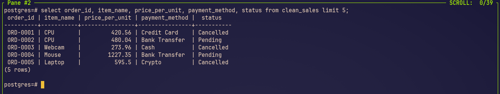

# K8S_ELT_Pipeline
ELT Pipeline using Apache Airflow and PostgreSQL in Kubernetes 
# *Overview*
Project repo to demonstrate ELT Pipeline using Apache Airflow and PostgreSQL in Kubernetes. Kubernetes is powerful container management, source manegement, scalable hence become useful tool for ELT Pipeline to orchestrate Airflow Webserver and PostgreSQL. The ELT Pipeline by extract JSON file and load into PostgreSQL database, create cleansing table in  PostgreSQL, conduct data cleansing the data. This project focusing how Kubernetes orchestration the ELT Pipeline instead the ELT Pipeline itself, but still ELT Pipeline still can be take as main topic if you want. 
# *Prerequisites*
To follow along this project there are requirements need to be available on system:
- Docker
  ```bash
  # install docker
  sudo apt install -y docker-ce docker-ce-cli containerd.io

  # check docker running
  docker --version
  ```
- Minikube
  ```bash
  # download minikube
  curl -LO https://storage.googleapis.com/minikube/releases/latest/minikube-linux-amd64

  # install minikube
  sudo install minikube-linux-amd64 /usr/local/bin/minikube

  # checking minikube running
  minikube version
  ```
- Helm
  ```bash
  # install helm
  curl https://raw.githubusercontent.com/helm/helm/master/scripts/get-helm-3 | bash

  # checking helm running
  helm version
  ```
- Kubectl
  ```bash
  # download the Google Cloud public signing key and add the Kubernetes apt repository to your system
  sudo curl -fsSLo /usr/share/keyrings/kubernetes-archive-keyring.gpg https://packages.cloud.google.com/apt/doc/apt-key.gpg
  echo "deb [signed-by=/usr/share/keyrings/kubernetes-archive-keyring.gpg] https://apt.kubernetes.io/ kubernetes-xenial main" | sudo tee      /etc/apt/sources.list.d/kubernetes.list

  # install kubectl
  sudo apt-get update
  sudo apt-get install -y kubectl   
  ```
- Vim (optional)
  ```bash
  sudo apt install vim
  ```
# *Project Flow*
1. Create folder for Kubernetes
   ```bash
   mkdir kubernetes/airflow
   ```
3. Start minikube
   ```bash
   # minikuce start
   minikube start --driver=docker --memory=4g --cpus=2

   # minikube checking
   minikube status
   ```
4. Add Helm Repository for Apache Airflow
   ```bash
   # add helm repo
   helm repo add apache-airflow https://airflow.apache.org
   helm repo update
   ```
5. Create Namespace for Airflow
   ```bash
   kubectl create namespace airflow
   ```
6. Install Apache Airflow via Helm
   ```bash
   # install airflow through helm
   helm install airflow apache-airflow/airflow --namespace airflow \
    --set executor=KubernetesExecutor \
    --set dags.persistence.enabled=true \
    --set logs.persistence.enabled=true \
    --set images.airflow.repository=apache/airflow \
    --set images.airflow.tag=2.10.0 \
    --set extraPipPackages='{"pandas","psycopg2-binary"}'

   # checking the result after wait for 5-10 minutes until ready 
   kubectl get pods -n airflow
   ```
7. Access Airflow UI and Configure Postgres Connection
   ```bash
   # port forward webserver
   kubectl port-forward svc/airflow-api-server 8080:8080 -n airflow
   ```
   - Open http://localhost:8080 in your browser. Login with username admin and password admin (default; change it later via UI).
   - Add a Postgres connection for our tasks
     - Go to Admin > Connections > + (add new).
     - Connection ID: postgres_default
     - Connection Type: Postgres
     - Host: airflow-postgresql (the service name of the deployed Postgres)
     - Schema: postgres (default database)
     - Login: postgres
     - Password: postgres
     - Test the connection (should succeed), then save.
8. Create a Temporary Pod to Upload Files to the DAGs PVC
   ```bash
   # create temporary pod
   vim uplaod-pod.yaml

   # apply it
   kubectl apply -f upload-pod.yaml

   # upload JSON file
   kubectl cp sales_record.json airflow/upload-pod:/dags/sales_record.json

   # checking the result
   kubectl exec -it upload-pod -n airflow -- ls /dags
   ```
9. Create the DAG File for the ELT Pipeline
   ```bash
   # create dag file
   vim elt-dag.py

   # Copy the DAG to the PVC
   kubectl cp elt-dag.py airflow/upload-pod:/dags
   ```
10. Test and Run the Pipeline
    - Refresh the Airflow UI.
    - Trigger it manually (click Trigger DAG).
    - Monitor the run: Check logs for each task.
      
11. Verify in Postgres
    ```bash
    # Port-forward Postgres
    kubectl port-forward svc/airflow-postgresql 5432:5432 -n airflow

    # Connect locally using psql
    psql -h localhost -U postgres -d postgres
    

    # make query to check the result
    SELECT order_id, item_name, price_per_unit, payment_method, status FROM clean_sales limit 5;
    
